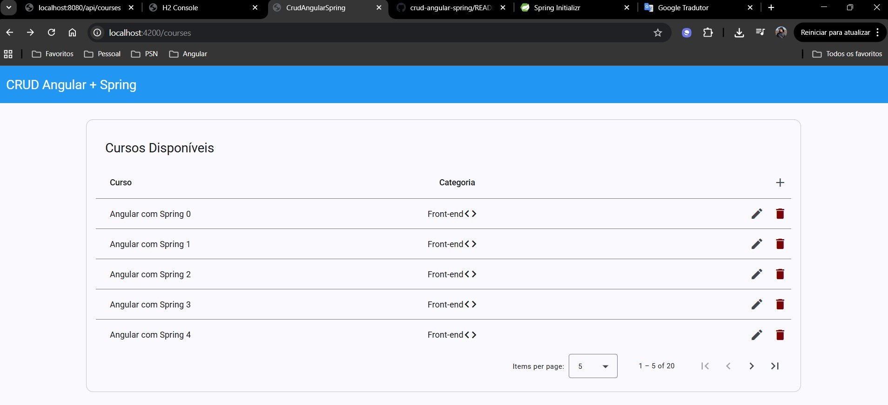
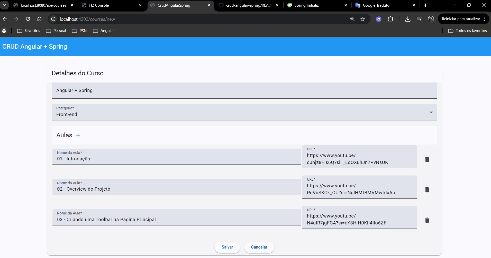

# 🚀 Angular + Spring

Projeto contempla uma aplicação de cadastro de cursos desenvolvida em Angular com backend em Java Spring.

### 🔧 Instalação

1) Instalação Java:
https://www.oracle.com/br/java/technologies/downloads

2) Instalação Maven:
https://maven.apache.org/download.cgi

3) Instalação Spring:
https://docs.spring.io/spring-boot/installing.html

4) Instalação Node.js:
https://nodejs.org/pt

5) Instalação Angular:
npm install -g @angular/cli

6) Acessar a pasta back-end via terminal, executar:
mvn spring-boot:run

7) Acessar a pasta front-end via terminal, executar:
ng serve --proxy-config proxy.conf.js

8) Acessar no navegador: http://localhost:4200

## 💻 Tecnologia

- Angular 20: https://angular.dev/installation
- Angular Material: https://material.angular.dev
- TypeScript
- JavaScript
- HMTL5
- SCSS
- Java 24
- Spring Boot 3
- Maven
- JPA + Hibernate

### 🛠️ Conceitos aplicados
- RxJs(Observables);
- Input, Output e Map;
- Lazy loading;
- DTOs, Mapper, Enums;
- Componentes front end reutilizáveis e escaláveis;
- Desenvolvimento responsivo;
- Acessibilidade;
- Standalone Components;
- Flow Control
- Karma e Jasmine;
- APIs em Java: Get, PUT, POST e DELETE;
- Entre outros.

## Algumas funcionalidades disponíveis na API

- ✅ Java model class with validation
- ✅ JPA repository
- ✅ JPA Pagination
- ✅ H2 database
- ✅ Controller, Service, and Repository layers
- ✅ Has-Many relationships (Course-Lessons)
- ✅ Java Records as DTO (Data Transfer Object)
- ✅ Hibernate / Jakarta Validation

## Screenshots

Main Page with Pagination

  

Form with One to Many (Course-Lessons)

  

## 🛠️ Outros projetos

Compartilho outros projetos na plataforma Stackblitz como exemplo de Observable no Angular e uma aplicação utilizando o conceito de SPA Services.
Disponível em: https://stackblitz.com/@AdrianoSantos

---
⌨️ 😊
